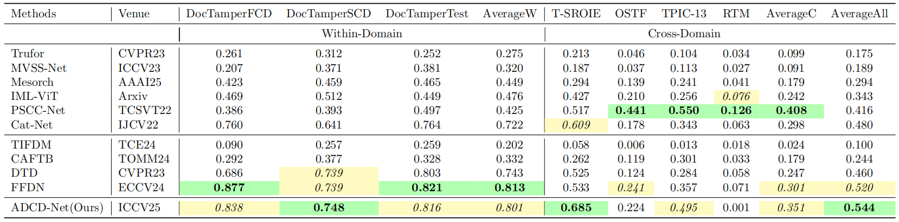

# [ICCV'25] ADCD-Net: Robust Document Image Forgery Localization via Adaptive DCT Feature and Hierarchical Content Disentanglement

[](https://arxiv.org/abs/2507.16397)

## Description   

The official source code of the paper "ADCD-Net: Robust Document Image Forgery Localization via Adaptive DCT Feature and Hierarchical Content Disentanglement". 


We present a robust document forgery localization model that adaptively leverages RGB/DCT forensic traces and incorporates key document image traits. To counter DCT traces' sensitivity to block misalignment, we modulate DCT feature contributions via predicted alignment scores, enhancing resilience to distortions like resizing and cropping. A hierarchical content disentanglement method boosts localization by reducing text-background disparities. Leveraging pristine background regions, we build a untampered prototype to improve accuracy and robustness.

## TODO

- [x] General inference pipline for images outside DocTamper
- [ ] Update better OCR model
- [x] Evaluate ADCD-Net on [ForensicHub](https://github.com/scu-zjz/ForensicHub) benchmark (Doc Protocol)
- [x] Release model checkpoint and OCR marks of DocTamper 
- [x] Release training and inference code

## ForensicHub Benchmark (Doc Protocol)



Models are trained on Doctamper train set and evaluated on seven test sets, please refer to [ForensicHub](https://github.com/scu-zjz/ForensicHub) for more details.
The best scores are marked in green and the second best scores are marked in yellow.

## Environment Setup

**ADCD-Net is trained on 4 NVIDIA GeForce RTX 4090 24G GPUs which takes about 33 hours**

Install dependencies: python 3.8, pytorch 1.11, albumentations 1.3.0

## Prepare Data

Download the DocTamper dataset from [DocTamper](https://github.com/qcf-568/DocTamper) (```qt_table.pk``` and files in ```pks``` can be also found from the DocTamper repository) and the ocr mask and model checkpoints from [ADCD-Net](https://drive.google.com/file/d/10m7v0RrmI68UbfaWCwAN0nfR2y7DWS_4/view?usp=sharing) (the data can be accessed without request from now on).
The files from ADCD-Net is organized as follows:

```
ADCD-Net.pth # ADCD-Net checkpoint
docres.pkl # DocRes checkpoint
DocTamperOCR/ # OCR mask directory
    ├── TrainingSet # Training set directory
    ├── TestingSet # Testing set directory
    ├── FCD # FCD dataset directory
    └── SCD # SCD dataset directory
```

## Get OCR masks of images not in DocTamper

We only provide the ocr mask of the DocTamper dataset. For other document images, you can use the script in ```seg_char``` to get the ocr mask."
First, download the OCR model CRAFT model checkpoint from [CRAFT](https://github.com/clovaai/CRAFT-pytorch). Then, set the checkpoint path and document image path in ```seg_char/main.py``` and run the code to get the ocr mask.

```python
ckpt_path = ''  # TODO: CRAFT model checkpoint
save_dir = '' # TODO: save dir of ocr masks
img_path = '' # TODO: input document image path

char_seger = CharSeger(ckpt_path=ckpt_path,
                       save_dir=save_dir)

char_seger.seg_char_per_img(img_path=img_path)
```

## Single Image Inference (New!)

We now provide easy-to-use scripts for testing ADCD-Net on single images or batches of images outside the DocTamper dataset.

### Quick Start

1. **Install inference dependencies:**
```bash
pip install -r requirements_inference.txt
```

2. **Test your setup:**
```bash
python test_setup.py \
    --model path/to/ADCD-Net.pth \
    --docres path/to/docres.pkl \
    --qt-table path/to/qt_table.pk
```

3. **Run inference on a single image:**
```bash
python inference.py \
    --image your_document.jpg \
    --model path/to/ADCD-Net.pth \
    --qt-table path/to/qt_table.pk \
    --output result.png
```

**Note:** The `--docres` argument is optional and not needed for inference with trained ADCD-Net models.

4. **Process multiple images:**
```bash
python batch_inference.py \
    --input-dir path/to/images/ \
    --output-dir path/to/outputs/ \
    --model path/to/ADCD-Net.pth \
    --docres path/to/docres.pkl \
    --qt-table path/to/qt_table.pk
```

For detailed instructions, see [INFERENCE_GUIDE.md](INFERENCE_GUIDE.md).

### Available Scripts

- **`inference.py`**: Main inference script with full pipeline (auto-detects DCT method)
- **`example_inference.py`**: Simple example for beginners
- **`batch_inference.py`**: Process multiple images in a directory
- **`test_setup.py`**: Verify your environment and setup
- **`test_dct_integration.py`**: Test DCT extraction compatibility

### DCT Extraction Methods

The inference scripts support **two DCT extraction methods** with automatic fallback:

1. **jpeg2dct library** (recommended for best accuracy)
   - Extracts DCT directly from JPEG file
   - 100% accuracy compared to training
   - May require system dependencies (libjpeg-dev)

2. **OpenCV workaround** (easier installation)
   - Computes DCT from image pixels using cv2.dct()
   - 85-95% correlation with jpeg2dct
   - No external dependencies beyond OpenCV
   - Automatically used if jpeg2dct not available

**The system automatically selects the best available method!**

For more information, see `INFERENCE_WITH_WORKAROUND.md`.

### Python API Usage

```python
from inference import SingleImageInference

# Initialize (docres is optional)
inferencer = SingleImageInference(
    model_ckpt_path='ADCD-Net.pth',
    qt_table_path='qt_table.pk',
    device='cuda'
)

# Run inference
results = inferencer.predict('document.jpg')

# Visualize
inferencer.visualize_results(results, save_path='output.png')
```


## Train with DocTamper

Before run the ```main.py```, please set the paths of the dataset, ocr mask and model checkpoint in ```cfg.py```. 
The DocRes checkpoint is provided in ```docres.pkl```. 

```python
mode = 'train'
root = 'path/to/root' # TODO:
ckpt = 'path/to/ADCD-Net.pth' # TODO:
docres_ckpt_path = 'path/to/docres.pkl' # TODO:
```

## Evaluate with DocTamper

Before run the ```main.py```, please set the paths of the dataset, distortions, ocr mask and model checkpoint in ```cfg.py```. 
The ADCD-Net checkpoint is provided in ```ADCDNet.pth```. 

```python
mode = 'val'
root = 'path/to/root' # TODO:
ckpt = 'path/to/ADCD-Net.pth' # TODO:
docres_ckpt_path = 'path/to/docres.pkl' # TODO:

multi_jpeg_val = False  # able to use multi jpeg distortion
jpeg_record = False  # manually set multi jpeg distortion record
min_qf = 75  # minimum jpeg quality factor
shift_1p = False  # shift 1 pixel for evaluation
val_aug = None # other distortions can be added here
```
## Citation

If you find our project useful in your research, please cite it in your publications.

```bibtex
@inproceedings{wong2025adcd,
  title={ADCD-Net: Robust Document Image Forgery Localization via Adaptive DCT Feature and Hierarchical Content Disentanglement},
  author={Wong, Kahim and Zhou, Jicheng and Wu, Haiwei and Si, Yain-Whar and Zhou, Jiantao},
  booktitle={Proceedings of the IEEE/CVF international conference on computer vision},
  year={2025}
}
```
