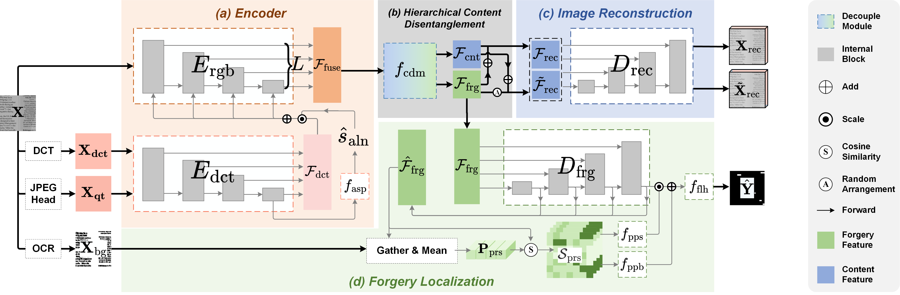

# [ICCV'25] ADCD-Net: Robust Document Image Forgery Localization via Adaptive DCT Feature and Hierarchical Content Disentanglement

[](https://arxiv.org/abs/2507.16397)


 
## Description   

The official source code of the paper "ADCD-Net: Robust Document Image Forgery Localization via Adaptive DCT Feature and Hierarchical Content Disentanglement". 

## Abstract   

The advancement of image editing tools has enabled malicious manipulation of sensitive document images, underscoring the need for robust document image forgery detection. Though forgery detectors for natural images have been extensively studied, they struggle with document images, as the tampered regions can be seamlessly blended into the uniform document background (BG) and structured text. On the other hand, existing document-specific methods lack sufficient robustness against various degradations, which limits their practical deployment. This paper presents ADCD-Net, a robust document forgery localization model that adaptively leverages the RGB/DCT forensic traces and integrates key characteristics of document images. Specifically, to address the DCT traces' sensitivity to block misalignment, we adaptively modulate the DCT feature contribution based on a predicted alignment score, resulting in much improved resilience to various distortions, including resizing and cropping. Also, a hierarchical content disentanglement approach is proposed to boost the localization performance via mitigating the text-BG disparities. Furthermore, noticing the predominantly pristine nature of BG regions, we construct a pristine prototype capturing traces of untampered regions, and eventually enhance both the localization accuracy and robustness. Our proposed ADCD-Net demonstrates superior forgery localization performance, consistently outperforming state-of-the-art methods by 20.79\% averaged over 5 types of distortions.

## Environment Setup

**ADCD-Net is trained on 4 NVIDIA GeForce RTX 4090 24G GPUs which takes about 33 hours**

Install dependencies: python 3.8, pytorch 1.11, albumentations 1.3.0

## Data Preparation

Download the DocTamper dataset from [DocTamper](https://github.com/qcf-568/DocTamper) (```qt_table.pk``` and files in ```pks``` can be also found from the DocTamper repository) and the ocr mask and model checkpoints from [ADCD-Net](https://drive.google.com/file/d/10m7v0RrmI68UbfaWCwAN0nfR2y7DWS_4/view?usp=sharing) (the data can be accessed without request from now on).
The files from ADCD-Net is organized as follows:

```
ADCD-Net.pth # ADCD-Net checkpoint
docres.pkl # DocRes checkpoint
DocTamperOCR/ # OCR mask directory
    ├── TrainingSet # Training set directory
    ├── TestingSet # Testing set directory
    ├── FCD # FCD dataset directory
    └── SCD # SCD dataset directory
```

## Get OCR Mask of images not in DocTamper

We only provide the ocr mask of the DocTamper dataset. For other document images, you can use the script in ```seg_char``` to get the ocr mask."
First, download the OCR model CRAFT model checkpoint from [CRAFT](https://github.com/clovaai/CRAFT-pytorch). Then, set the checkpoint path and document image path in ```seg_char/main.py``` and run the code to get the ocr mask.


## Training

Before run the ```main.py```, please set the paths of the dataset, ocr mask and model checkpoint in ```cfg.py```. 
The DocRes checkpoint is provided in ```docres.pkl```. 

```python
mode = 'train'
root = 'path/to/root' # TODO:
ckpt = 'path/to/ADCD-Net.pth' # TODO:
docres_ckpt_path = 'path/to/docres.pkl' # TODO:
```

## Evaluation

Before run the ```main.py```, please set the paths of the dataset, distortions, ocr mask and model checkpoint in ```cfg.py```. 
The ADCD-Net checkpoint is provided in ```ADCDNet.pth```. 

```python
mode = 'val'
root = 'path/to/root' # TODO:
ckpt = 'path/to/ADCD-Net.pth' # TODO:
docres_ckpt_path = 'path/to/docres.pkl' # TODO:

multi_jpeg_val = False  # able to use multi jpeg distortion
jpeg_record = False  # manually set multi jpeg distortion record
min_qf = 75  # minimum jpeg quality factor
shift_1p = False  # shift 1 pixel for evaluation
val_aug = None # other distortions can be added here
```
