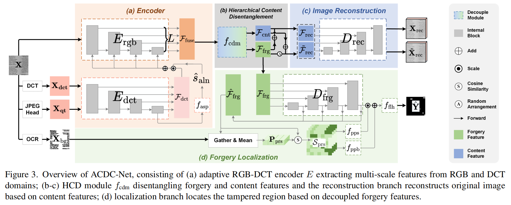

# [ICCV'25] ADCD-Net: Robust Document Image Forgery Localization via Adaptive DCT Feature and Hierarchical Content Disentanglement

 
## Description   

The official source code of the paper "ADCD-Net: Robust Document Image Forgery Localization via Adaptive DCT Feature and Hierarchical Content Disentanglement". 

## Abstract   

The advancement of image editing tools has enabled malicious manipulation of sensitive document images, underscoring the need for robust document image forgery detection. Though forgery detectors for natural images have been extensively studied, they struggle with document images, as the tampered regions can be seamlessly blended into the uniform document background (BG) and structured text. On the other hand, existing document-specific methods lack sufficient robustness against various degradations, which limits their practical deployment. This paper presents ADCD-Net, a robust document forgery localization model that adaptively leverages the RGB/DCT forensic traces and integrates key characteristics of document images. Specifically, to address the DCT traces' sensitivity to block misalignment, we adaptively modulate the DCT feature contribution based on a predicted alignment score, resulting in much improved resilience to various distortions, including resizing and cropping. Also, a hierarchical content disentanglement approach is proposed to boost the localization performance via mitigating the text-BG disparities. Furthermore, noticing the predominantly pristine nature of BG regions, we construct a pristine prototype capturing traces of untampered regions, and eventually enhance both the localization accuracy and robustness. Our proposed ADCD-Net demonstrates superior forgery localization performance, consistently outperforming state-of-the-art methods by 20.79\% averaged over 5 types of distortions.

## The code will be available soon
